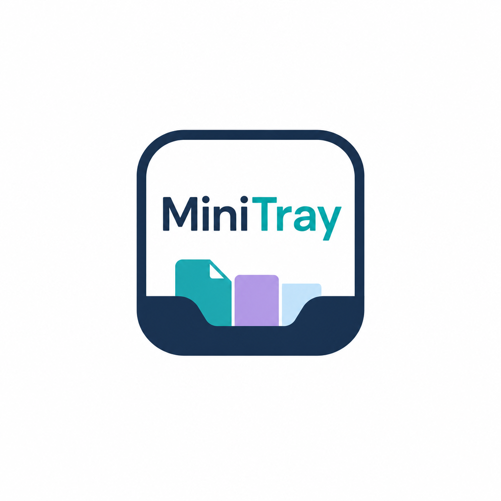

# MiniTray para macOS

<p align="center">
  
</p>

MiniTray es una utilidad nativa de barra de menús para reunir temporalmente archivos, carpetas e imágenes mientras se trabaja entre Finder y otras aplicaciones. Mantiene una sola bandeja flotante y guarda únicamente referencias en memoria: añadir o cerrar nunca mueve ni elimina los originales.

Versión publicada: **0.2.9 — código abierto bajo licencia MIT**. Reúne las animaciones nativas, el movimiento hacia Finder, el papel blanco de las miniaturas PDF y las previsualizaciones de arrastre con una pequeña flecha de traslado. Consulta las [notas de esta versión](Docs/Releases/0.2.9.md) para distinguir las comprobaciones realizadas de los límites pendientes.

[Descargar MiniTray para macOS](https://github.com/Jairoalejo456/minitray-macos/releases/latest) · [Licencia MIT](LICENSE) · [Registro de cambios](CHANGELOG.md)

## Requisitos

- macOS 14.0 o posterior.
- Xcode 26 o posterior para compilar el código con las APIs de Liquid Glass. La compilación de entrega se verificó con Xcode 26.6 y Swift 6.3.3 en modo de lenguaje Swift 5.
- Un Mac con AirDrop disponible para comprobar el flujo de compartición real.

No hay dependencias de terceros, servidor ni cuenta. El contenido de la bandeja permanece en memoria; solo se guardan las preferencias.

## Descargar la aplicación

1. Descarga el ZIP universal desde [la última versión publicada](https://github.com/Jairoalejo456/minitray-macos/releases/latest).
2. Descomprímelo, mueve **MiniTray.app** a **Aplicaciones** y ábrela. El ZIP sirve para Apple Silicon e Intel e incluye la licencia MIT dentro de la aplicación.
3. Concede **Monitorización de entrada** cuando macOS lo solicite para detectar la sacudida global.

La descarga tiene firma ad hoc y todavía no está notarizada. macOS puede bloquear su primera apertura; revisa **Ajustes del sistema → Privacidad y seguridad** para autorizarla si confías en esta descarga, siguiendo la [guía de Apple](https://support.apple.com/en-us/102445). También puedes compilarla desde el código siguiendo las instrucciones siguientes.

## Abrir y usar

1. Abre `MiniTray.xcodeproj` en Xcode.
2. Selecciona el esquema **MiniTray** y el destino **My Mac**.
3. Pulsa **Run** (`⌘R`). La app aparece únicamente con su icono de bandeja en la barra de menús; no añade texto ni ocupa espacio en el Dock.
4. La primera vez, acepta **Monitorización de entrada** cuando macOS lo solicite. Este permiso permite observar pasivamente los eventos del ratón de un arrastre que empezó en Finder u otra app. MiniTray no solicita eventos del teclado ni puede modificar los eventos observados. Si macOS pide reiniciarla, sal y vuelve a abrirla.
5. Empieza a arrastrar uno o más elementos en Finder.
6. Sin soltar el botón, sacude el cursor con tres cambios rápidos de dirección. Puede ser un movimiento horizontal, vertical o diagonal. La bandeja aparecerá cerca del cursor y siempre dentro del área visible de la pantalla.
7. Suelta los elementos en cualquier punto de la bandeja, incluida la previsualización central. La bandeja permanece pequeña y enseña la imagen o miniatura completa, respetando su proporción, con hasta dos tarjetas detrás para indicar que hay más contenido.
8. Arrastra esa pila para sacar todos los elementos de una vez, o pulsa la cápsula de cantidad para abrir la cuadrícula y arrastrar uno o varios. Al soltar en otra carpeta del mismo volumen, Finder mueve los archivos originales; MiniTray ya no limita la salida a copiar. Cuando el destino acepta el arrastre, la bandeja se cierra automáticamente; si cancelas, conserva todo.

Recoger un archivo en la bandeja **no lo mueve ni programa una operación pendiente**. Cerrar la bandeja solo olvida sus referencias. El traslado lo ejecuta Finder al aceptar el depósito; MiniTray nunca borra un original después de recibir una notificación de salida. Se respetan las reglas nativas del destino: **Opción (⌥)** permite pedir una copia, y **Comando (⌘)** permite pedir un movimiento cuando Finder elegiría copiar, por ejemplo entre volúmenes distintos. Adjuntar a otra aplicación o compartir no elimina el original. Una imagen que solo existe en memoria se materializa como un nuevo PNG porque no tiene un archivo de origen que trasladar. Véanse las [operaciones de arrastre de AppKit](https://developer.apple.com/documentation/appkit/nsdragginginfo/draggingsourceoperationmask).

También se puede abrir una bandeja vacía desde el icono de barra de menús con **Mostrar bandeja**. Si no recibe nada, se oculta automáticamente; al terminar un arrastre sin depósito también se oculta. La sensibilidad del gesto puede cambiarse entre baja, equilibrada y alta desde ese menú, pero la configuración equilibrada funciona desde el primer inicio.

El menú de barra incluye **Ajustes…**. Allí se puede:

- activar o desactivar que MiniTray se abra automáticamente al iniciar la sesión del Mac;
- cambiar la sensibilidad de la sacudida;
- activar un atajo global y elegir entre cuatro combinaciones para mostrar la bandeja;
- activar la detección de capturas guardadas por macOS y elegir entre 1 y 10 segundos de visibilidad;
- activar o desactivar que un doble clic sobre la previsualización o un elemento revele el archivo en Finder.

El atajo y la detección de capturas empiezan desactivados para evitar interferencias. Las preferencias sí se conservan entre aperturas; los elementos de la bandeja nunca se conservan.

La franja superior permite mover el panel. La vista compacta muestra únicamente la **X**, la pila y la cápsula de cantidad; no hay título, papelera ni acciones para quitar elementos. Cerrar con la **X** vacía la colección y oculta la bandeja, pero nunca elimina los originales. Las cachés de miniaturas y la última selección de Quick Look pueden permanecer en memoria hasta reemplazarse o terminar el proceso; no restauran la bandeja al reiniciar. La flecha superior abre un menú nativo con **Abrir con**, **Mostrar en Finder**, **Vista rápida** y los servicios de compartir que macOS tenga disponibles para esos elementos, incluidos AirDrop, Mail, Mensajes y otras extensiones instaladas. **Más opciones…** abre el selector completo del sistema.

La confirmación de compartir usa la misma animación para **todos los servicios nativos**, tanto los accesos directos como los de **Más opciones…**; no depende de que el destino sea AirDrop. MiniTray espera la confirmación que comunica el servicio de macOS, no una confirmación de entrega o lectura del destinatario. Una app de terceros también queda cubierta si ofrece una extensión nativa de compartir y notifica su finalización. **Abrir con** es distinto: solo abre el archivo y no informa si posteriormente se envió dentro de otra aplicación; en esa ruta no se simula un envío confirmado.

En macOS 26 o posterior, la bandeja usa el material Liquid Glass real de SwiftUI con un tinte carbón ligero que deja pasar el color y la luz del fondo. Los controles conservan su propia profundidad de vidrio sin atenuar el contenido al interactuar. En macOS 14 y 15 mantiene la misma jerarquía con materiales nativos translúcidos. Si está activado **Reducir transparencia**, emplea un fondo oscuro sólido de alto contraste.

La vista compacta mide 236 × 236 puntos cuando contiene elementos y la cuadrícula usa 480 puntos de ancho. La entrada combina un rebote pequeño con un barrido de luz; el depósito confirma la recepción y las carpetas se absorben hacia la bandeja. Expandir y colapsar anima el marco real durante 300 ms, manteniendo su geometría y sus zonas de clic sincronizadas incluso al invertir la transición. La salida dura 200 ms. Compartir anima los elementos en cascada cuando macOS confirma la operación; cancelar el selector o el envío conserva la bandeja. **Reducir movimiento** utiliza únicamente fundidos de 120 ms, sin desplazamiento, escala, giro, desenfoque ni barrido de luz.

Al pulsar la cápsula se abre una cuadrícula con todas las previsualizaciones y el tamaño total. El botón de regreso vuelve a la vista compacta sin perder contenido. La bandeja no crece al añadir más archivos mientras siga contraída; incluso con decenas de elementos conserva el mismo tamaño.

Los PDF muestran su primera página sobre **papel blanco opaco**, respetando recorte y rotación. Solo se rasteriza la miniatura, en segundo plano: el documento original nunca se modifica. Las imágenes PNG con transparencia conservan su canal alfa. Si un PDF no puede abrirse, se utiliza el icono de archivo como respaldo.

Al arrastrar se reutiliza la miniatura disponible en lugar del icono genérico; si aún está cargando, se actualiza durante el arrastre. Una **flecha de 16 puntos** acompaña al primer archivo del grupo como señal de intención de traslado. **No certifica que el destino acepte el archivo ni que vaya a moverlo**: AppKit solo comunica al origen la operación definitiva al terminar. El cursor nativo de copia/rechazo permanece intacto. Al mantener Opción para copiar, la flecha se retira; las imágenes solo en memoria no la muestran. El control de modificadores funciona únicamente durante el arrastre y se detiene al terminar o cancelar. Referencias: [imágenes de arrastre de AppKit](https://developer.apple.com/documentation/appkit/nsdraggingitem/imagecomponentsprovider) y [geometría de páginas PDF](https://developer.apple.com/documentation/coregraphics/cgpdfpage).

## Compilar y probar desde Terminal

Compilación Debug:

```bash
xcodebuild \
  -project MiniTray.xcodeproj \
  -scheme MiniTray \
  -configuration Debug \
  -derivedDataPath /tmp/MiniTrayDerivedData \
  build
```

Pruebas:

```bash
xcodebuild test \
  -project MiniTray.xcodeproj \
  -scheme MiniTray \
  -configuration Debug \
  -derivedDataPath /tmp/MiniTrayDerivedData \
  -destination 'platform=macOS' \
  -parallel-testing-enabled NO
```

Sal primero de la copia instalada de MiniTray para evitar la protección de instancia única. Para probar sin interrumpirla, añade `PRODUCT_BUNDLE_IDENTIFIER=com.example.minitray.qa` al comando de pruebas; esto cambia únicamente la identidad de esa compilación local.

Una compilación universal (Apple Silicon + Intel) lista para abrir queda en `dist/MiniTray.app` después del build Release usado para esta entrega. Tiene firma ad hoc local; no está notarizada ni firmada para distribución pública.

Para generar la aplicación y el ZIP de una versión local:

```bash
./scripts/build-release.sh
```

Las versiones publicadas y sus binarios se encuentran en [GitHub Releases](https://github.com/Jairoalejo456/minitray-macos/releases).

## Arquitectura

- **SwiftUI** compone la presentación, el material, la jerarquía y los estados visuales.
- **Liquid Glass / materiales de AppKit** proporcionan profundidad y contexto sin sacrificar legibilidad: vidrio real en macOS 26, material translúcido de respaldo en macOS 14–15 y superficie sólida con Reducir transparencia.
- **NSPanel** proporciona una ventana no activante, movible por su cabecera y permanentemente elevada mientras está visible, sin quitar el foco a la aplicación de trabajo.
- **Superposición estable** mantiene la única bandeja por encima de ventanas normales y paneles modales durante todo su ciclo visible; solo abandona el primer plano cuando se cierra o queda vacía.
- **NSCollectionView / NSPasteboard** reciben URLs de archivo, carpetas e imágenes y publican de nuevo los elementos mediante drag & drop estándar. La pila compacta ofrece el conjunto completo; la cuadrícula permite una selección individual o múltiple. `TrayDragPolicy` ofrece movimiento y copia para las URLs originales, sin operaciones de borrado ni alias; el destino negocia la operación y los modificadores nativos siguen disponibles. Una imagen sin archivo de origen se conserva en memoria y se ofrece como PNG mediante `NSFilePromiseProvider` solo cuando el usuario la deposita fuera. La máscara de la cuadrícula se calcula a partir de la selección arrastrada, no del resto de la bandeja. Una salida aceptada descarta las referencias y cierra el panel; una salida cancelada no cambia el estado.
- **Quick Look Thumbnailing** solicita a macOS la miniatura nativa de cada URL. Imágenes, PDF, vídeo, documentos y otros formatos compatibles muestran su contenido; un tipo sin generador Quick Look usa como respaldo el icono nativo de Finder.
- **Core Graphics** instala un monitor pasivo (`listenOnly`) de sesión para tres eventos del ratón: botón izquierdo pulsado, arrastre y liberación. Monitorización de entrada permite recibirlos cuando el arrastre pertenece a Finder u otra aplicación. El monitor nunca modifica ni bloquea eventos y su máscara excluye el teclado. Mientras falta el permiso, un muestreo limitado de posición y botón mantiene una alternativa funcional. El detector vectorial exige segmentos rápidos, distancia acumulada, tres inversiones de dirección y un tiempo de enfriamiento, sin privilegiar el eje horizontal, vertical o diagonal. Antes de mostrar el panel, MiniTray comprueba además que macOS haya iniciado durante esa pulsación un portapapeles de arrastre nuevo con archivos o imágenes importables; una selección ordinaria o un lienzo que solo mueve su contenido no pasa esa validación. Solo hay un `NSPanel` y Launch Services prohíbe múltiples instancias de la app.
- **Service Management** registra opcionalmente la aplicación principal como ítem de inicio mediante `SMAppService.mainApp`. El interruptor refleja el estado real de macOS y ofrece acceso al panel nativo de Ítems de inicio cuando el sistema exige aprobación.
- **Carbon RegisterEventHotKey** registra opcionalmente el atajo global seleccionado sin inspeccionar pulsaciones y sin solicitar Accesibilidad.
- **Spotlight (`NSMetadataQuery`)** detecta opcionalmente capturas nuevas marcadas por macOS, descarta resultados anteriores y muestra una bandeja vacía durante el intervalo elegido. No copia la captura ni la añade automáticamente.
- **NSWorkspace, Quick Look y NSSharingService** construyen el menú de acciones con las aplicaciones y servicios que el sistema declara compatibles. AirDrop usa el flujo nativo y cancelar el selector conserva la bandeja.

## Permisos y privacidad

MiniTray solicita **Monitorización de entrada** para detectar con fiabilidad la sacudida durante arrastres iniciados en otras aplicaciones. Usa un monitor pasivo de Core Graphics limitado a tres eventos del botón izquierdo; no observa el teclado, no altera los eventos y no solicita Accesibilidad, Grabación de pantalla, Automatización ni acceso completo al disco. Si se deniega, el menú y Ajustes lo indican expresamente y la app mantiene un modo de detección limitado junto con **Mostrar bandeja** y el atajo opcional.

Los archivos llegan únicamente porque el usuario los arrastra. El target no usa App Sandbox en este MVP para que las URLs explícitamente depositadas sigan siendo utilizables durante la sesión. No se sube información, no hay analítica y nada de la bandeja se restaura tras reiniciar.

El permiso se puede conceder desde **Ajustes del sistema → Privacidad y seguridad → Monitorización de entrada**. La app vuelve a comprobarlo al activarse. En un Mac administrado, una política de seguridad podría impedir la entrega de eventos globales; en ese caso muestra el estado limitado y **Mostrar bandeja** queda como alternativa comprensible.

## Limitaciones conocidas

- El contenido es deliberadamente efímero. Si el archivo original se mueve o borra desde otra aplicación, la referencia puede dejar de funcionar.
- AirDrop depende del hardware, de la configuración del sistema y de la disponibilidad de dispositivos cercanos.
- La detección de capturas solo puede reaccionar a archivos que macOS haya guardado e indexado como capturas. Una captura enviada únicamente al portapapeles no crea un archivo y no se detecta; Spotlight desactivado o una ubicación no indexada también pueden impedirla.
- El atajo global ofrece cuatro combinaciones predefinidas. Si otra aplicación ya usa la elegida, Ajustes muestra el conflicto y permite escoger otra.
- No hay historial, múltiples bandejas, sincronización, enlaces, compresión, extensiones de Finder, cuentas ni pagos.
- El ZIP público tiene firma ad hoc y puede requerir autorización de apertura en macOS. La firma Developer ID y la notarización están pendientes para una distribución más cómoda.

El resultado de la auditoría final está en [Docs/Final-Audit-0.2.5.md](Docs/Final-Audit-0.2.5.md), la guía de repetición manual en [Docs/Manual-QA.md](Docs/Manual-QA.md) y las referencias visuales en [Docs/Visual-Research.md](Docs/Visual-Research.md).

## Contribuir y reportar problemas

Las mejoras y correcciones son bienvenidas mediante issues y pull requests. Consulta [CONTRIBUTING.md](CONTRIBUTING.md) antes de enviar cambios y [SECURITY.md](SECURITY.md) para comunicar vulnerabilidades sin exponerlas públicamente.

## Licencia

MiniTray se distribuye bajo la [licencia MIT](LICENSE), cuyo texto estándar publica la [Open Source Initiative](https://opensource.org/license/mit). Permite usar, modificar y redistribuir el proyecto, incluido el uso comercial, conservando el aviso de copyright y la licencia. Se ofrece sin garantía.

La licencia se incluye en el repositorio, en el código fuente de esta versión y en `MiniTray.app/Contents/Resources/LICENSE` dentro de cada nueva compilación.
